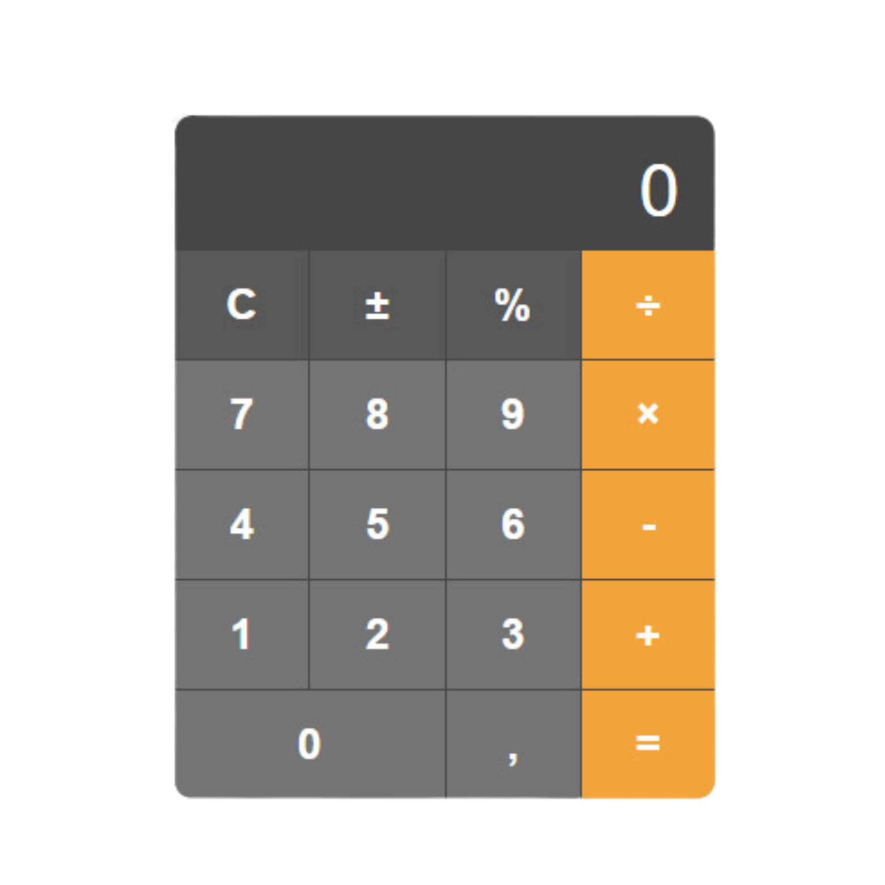

# 🧮 iOS-Style Calculator

This project was developed to improve my programming skills, particularly in **JavaScript** and **HTML**, and enhance my digital logic. The design is inspired by the iOS calculator, and it implements key functionalities like addition, subtraction, multiplication, and division. Additional features include percentage calculation and sign inversion.



## Table of Contents
- [Overview](#overview)
- [Features](#features)
- [Installation](#installation)
- [Project Structure](#project-structure)
- [Usage](#usage)
- [Future Improvements](#future-improvements)

---

## Overview

This project replicates the **iOS calculator** using **HTML**, **CSS**, and **JavaScript**. The goal is to create a fully functional web-based calculator with the following key operations: addition, subtraction, multiplication, division, percentage calculations, and sign inversion. The project is designed for responsive use across different device sizes.

The main learning objective was to solidify my understanding of DOM manipulation with JavaScript and to apply CSS styling techniques to create a visually appealing interface.

## Features

- **Basic Arithmetic**: Perform addition, subtraction, multiplication, and division.
- **Percentage Calculation**: Calculate percentages of numbers.
- **Sign Inversion**: Switch between positive and negative values.
- **Clear Function**: Reset the calculator to its initial state.
- **Responsive Design**: Optimized for both desktop and mobile devices.

### Detailed Features:

1. **Addition, Subtraction, Multiplication, Division**: Operations are performed based on the user’s input and reflected in the calculator's display.
2. **Percentage**: The percentage function calculates the value based on the current input.
3. **Sign Inversion**: The ± button allows toggling the sign of the current number.
4. **Clear Button (C)**: The calculator can be reset at any time by clicking the clear button.

## Installation

1. Clone the repository:
    ```bash
    git clone https://github.com/your_username/ios-style-calculator.git
    cd ios-style-calculator
    ```

2. No additional dependencies are required as this is a front-end project.

3. Open `index.html` in your web browser to run the calculator locally.

## Project Structure

```bash
ios-style-calculator/
│
├── index.html       # Main HTML file for the calculator
├── style.css        # CSS file for styling the calculator
└── script.js        # JavaScript file for handling calculator logic
```

- index.html: The structure of the calculator, including the display and buttons.
- style.css: Contains styles that replicate the look and feel of the iOS calculator.
- script.js: Contains the logic that handles user interactions and performs calculations.

## Usage

1. Open the Calculator: Open the index.html file in your browser.
2. Perform Calculations: Use the on-screen buttons to perform arithmetic operations.
3. Clear Results: Press the C button to reset the calculator.

## Future Improvements

In the future, the following features may be added:

- Keyboard Support: Allow users to input numbers and operations via the keyboard.
- History of Calculations: Implement a feature to display the history of recent calculations.
- Theming Options: Add dark mode and custom color themes to the calculator interface.
- Scientific Mode: Expand the calculator to include advanced mathematical functions.
